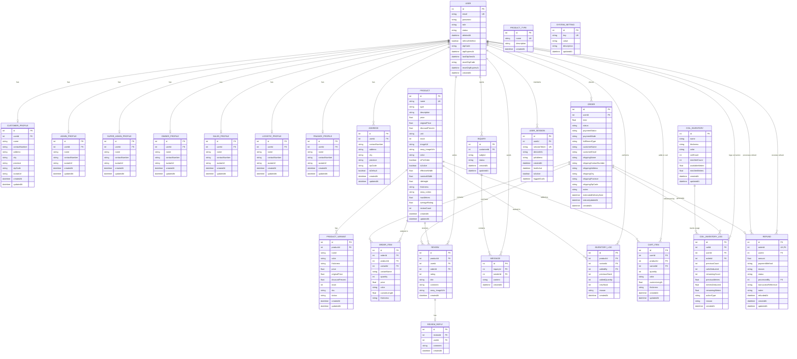

# Entity Relationship Diagram (ERD)

This document presents the relational structure of the Mega Pacific database.

```mermaid
erDiagram
    USER {
        int id PK
        string email UK
        string password
        string role
        string status
        datetime deletedAt
        boolean isEmailVerified
        string otpCode
        datetime otpExpiresAt
        datetime lastOtpSentAt
        string resetOtpCode
        datetime resetOtpExpiresAt
        datetime createdAt
    }

    CUSTOMER_PROFILE {
        int id PK
        int userId FK
        string name
        string contactNumber
        string address
        string city
        string province
        string zipCode
        string avatarUrl
        datetime createdAt
        datetime updatedAt
    }

    ADMIN_PROFILE {
        int id PK
        int userId FK
        string name
        string contactNumber
        string avatarUrl
        datetime createdAt
        datetime updatedAt
    }

    SUPER_ADMIN_PROFILE {
        int id PK
        int userId FK
        string name
        string contactNumber
        string avatarUrl
        datetime createdAt
        datetime updatedAt
    }

    OWNER_PROFILE {
        int id PK
        int userId FK
        string name
        string contactNumber
        string avatarUrl
        datetime createdAt
        datetime updatedAt
    }

    SALES_PROFILE {
        int id PK
        int userId FK
        string name
        string contactNumber
        string avatarUrl
        datetime createdAt
        datetime updatedAt
    }

    LOGISTIC_PROFILE {
        int id PK
        int userId FK
        string name
        string contactNumber
        string avatarUrl
        datetime createdAt
        datetime updatedAt
    }

    FINANCE_PROFILE {
        int id PK
        int userId FK
        string name
        string contactNumber
        string avatarUrl
        datetime createdAt
        datetime updatedAt
    }

    ADDRESS {
        int id PK
        int userId FK
        string contactNumber
        string address
        string city
        string province
        string zipCode
        boolean isDefault
        datetime createdAt
        datetime updatedAt
    }

    PRODUCT {
        int id PK
        string name UK
        string type
        string description
        float price
        float originalPrice
        float discountPercent
        string unit
        int stock
        string imageUrl
        string array_imageUrls
        string color
        boolean isPreOrder
        boolean isActive
        float effectiveWidth
        float nominalWidth
        float ribHeight
        string thickness
        string array_colors
        float maxMeters
        float averageRating
        int reviewCount
        datetime createdAt
        datetime updatedAt
    }

    PRODUCT_VARIANT {
        int id PK
        int productId FK
        string name
        string color
        string thickness
        float price
        float originalPrice
        float discountPercent
        int stock
        string sku
        string status
        datetime createdAt
        datetime updatedAt
    }

    ORDER {
        int id PK
        int userId FK
        float total
        string status
        string paymentStatus
        string paymentMode
        string fulfillmentType
        string customerName
        string customerEmail
        string shippingName
        string shippingContactNumber
        string shippingAddress
        string shippingCity
        string shippingProvince
        string shippingZipCode
        string notes
        datetime estimatedDeliveryDate
        datetime statusUpdatedAt
        datetime createdAt
    }

    ORDER_ITEM {
        int id PK
        int orderId FK
        int productId FK
        int variantId FK
        string variantName
        int quantity
        float price
        string color
        float customLength
        string thickness
    }

    REVIEW {
        int id PK
        int productId FK
        int userId FK
        int orderId FK
        int rating
        string title
        string comment
        string array_imageUrls
        datetime createdAt
    }

    REVIEW_REPLY {
        int id PK
        int reviewId FK
        int userId FK
        string comment
        datetime createdAt
    }

    INQUIRY {
        int id PK
        int customerId FK
        string subject
        string status
        datetime createdAt
        datetime updatedAt
    }

    MESSAGE {
        int id PK
        int inquiryId FK
        int senderId FK
        string content
        datetime createdAt
    }

    PRODUCT_TYPE {
        int id PK
        string name UK
        string description
        datetime createdAt
    }

    INVENTORY_LOG {
        int id PK
        int productId FK
        int variantId FK
        int addedBy FK
        int previousStock
        int addedQuantity
        int newStock
        string reason
        datetime createdAt
    }

    CART_ITEM {
        int id PK
        int userId FK
        int productId FK
        int variantId FK
        int quantity
        string color
        float customLength
        string thickness
        datetime createdAt
        datetime updatedAt
    }

    COIL_INVENTORY {
        int id PK
        string name
        string thickness
        string color
        int coilCount
        int minAlertCount
        float availableMeters
        float minAlertMeters
        datetime createdAt
        datetime updatedAt
    }

    COIL_INVENTORY_LOG {
        int id PK
        int coilId FK
        int userId FK
        int orderId FK
        int previousCount
        int coilsDeducted
        int remainingCount
        float previousMeters
        float metersDeducted
        float remainingMeters
        string actionType
        string reason
        datetime createdAt
    }

    USER_SESSION {
        int id PK
        int userId FK
        string sessionToken UK
        string deviceInfo
        string ipAddress
        datetime createdAt
        datetime lastActive
        boolean isActive
        datetime loggedOutAt
    }

    SYSTEM_SETTING {
        int id PK
        string key UK
        string value
        string description
        datetime updatedAt
    }

    REFUND {
        int id PK
        int orderId UK, FK
        int userId FK
        float amount
        string paymentMethod
        string reason
        string status
        int processedBy FK
        string transactionReference
        string notes
        datetime refundedAt
        datetime createdAt
        datetime updatedAt
    }

    USER ||--o| CUSTOMER_PROFILE : "has"
    USER ||--o| ADMIN_PROFILE : "has"
    USER ||--o| SUPER_ADMIN_PROFILE : "has"
    USER ||--o| OWNER_PROFILE : "has"
    USER ||--o| SALES_PROFILE : "has"
    USER ||--o| LOGISTIC_PROFILE : "has"
    USER ||--o| FINANCE_PROFILE : "has"
    USER ||--o{ ORDER : "places"
    USER ||--o{ ADDRESS : "has"
    USER ||--o{ REVIEW : "writes"
    USER ||--o{ INQUIRY : "opens"
    USER ||--o{ MESSAGE : "sends"
    USER ||--o{ INVENTORY_LOG : "performs"
    USER ||--o{ CART_ITEM : "adds to cart"
    USER ||--o{ USER_SESSION : "maintains"
    USER ||--o{ COIL_INVENTORY_LOG : "logs coil action"
    USER ||--o{ REFUND : "receives refund"
    USER ||--o{ REFUND : "processes refund"
    PRODUCT ||--o{ PRODUCT_VARIANT : "has"
    PRODUCT ||--o{ ORDER_ITEM : "ordered in"
    PRODUCT ||--o{ REVIEW : "receives"
    PRODUCT ||--o{ INVENTORY_LOG : "tracked in"
    PRODUCT ||--o{ CART_ITEM : "added as"
    ORDER ||--o{ ORDER_ITEM : "contains"
    ORDER ||--o{ REVIEW : "can have"
    ORDER ||--o{ COIL_INVENTORY_LOG : "referenced by"
    ORDER ||--o| REFUND : "generates"
    COIL_INVENTORY ||--o{ COIL_INVENTORY_LOG : "tracks usage"
    REVIEW ||--o| REVIEW_REPLY : "has"
    INQUIRY ||--o{ MESSAGE : "contains"
```
