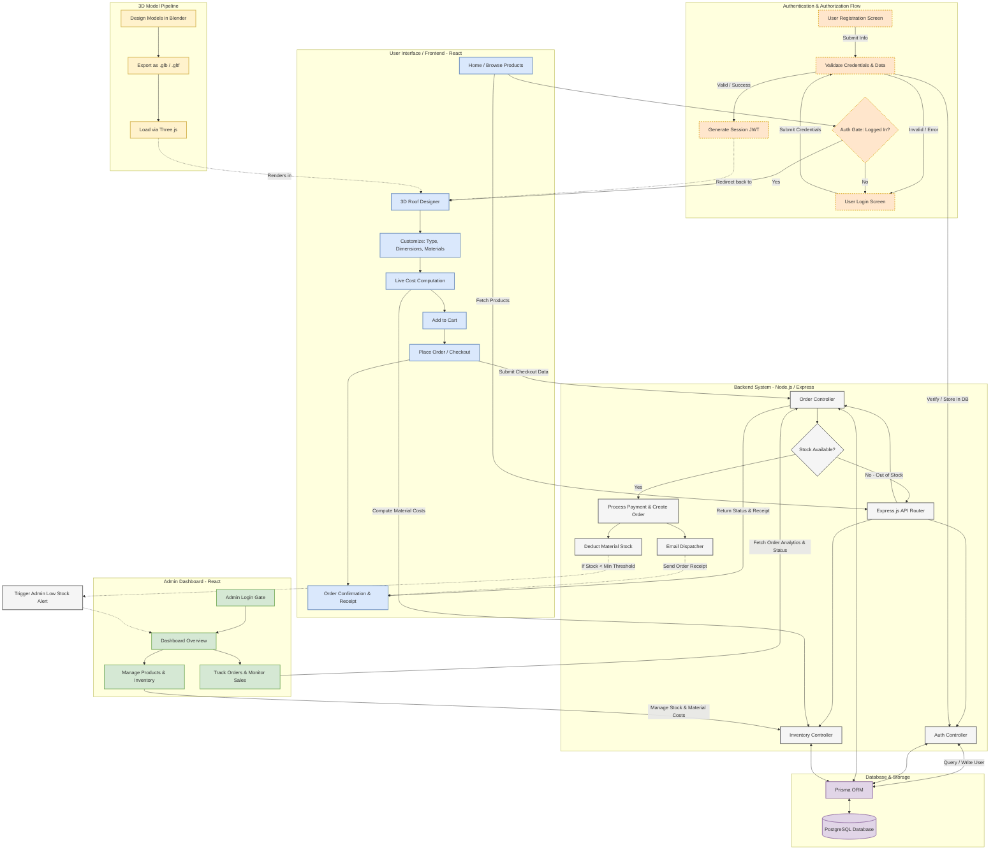

# 🔄 System Flowchart

This document outlines the high-level flow of the **3D Roofing Design and Inventory Management System**, including the user experience, admin management, backend data flow, and the 3D asset pipeline.

## System Architecture Flow

The following Mermaid diagram visualizes the overall architecture and interactions between different modules of the system, highlighting the dedicated authentication flow, real-time inventory management logic, and automated order confirmation flows:

### Flow Highlights:

1. **Authentication & Authorization Gate (Updated):** Registration and Login forms are moved into their own dedicated, decoupled flow. When users attempt to design or place an order, they encounter the `Auth Gate`. Non-authenticated requests are intercepted and redirected to the login panel. Upon validation via the JWT-based backend Auth Controller, they are returned back to their original flow.
2. **3D Integration Flow:** 3D Models are created and optimized in Blender, exported in `.glb`/`.gltf` format, and loaded dynamically into the interactive designer via Three.js.
3. **Inventory Management & Logic (New):** Features real-time stock control. When customizing materials or placing an order (`Checkout`), the Backend API queries PostgreSQL via Prisma to check availability. Stock is automatically deducted (`InvDeduct`) upon successful checkout. If material stock levels fall below a critical threshold, it triggers a warning alert directly visible on the Admin Dashboard.
4. **Order Confirmation & Checkout Flow (New):** Placing an order initiates a backend chain: stock verification -> payment/order database entry creation -> automatic stock deduction -> trigger to an automated `Email Dispatcher` -> returning a visual `Order Confirmation & Receipt` to the user's interface in real-time.
5. **Data & Admin Flow:** All client interactions (both from users and admins) communicate with the Node.js/Express backend API, which queries the PostgreSQL database via Prisma ORM. Admins use their dashboard to review sales performance, respond to low-stock notifications, and update physical inventories and pricing parameters.
