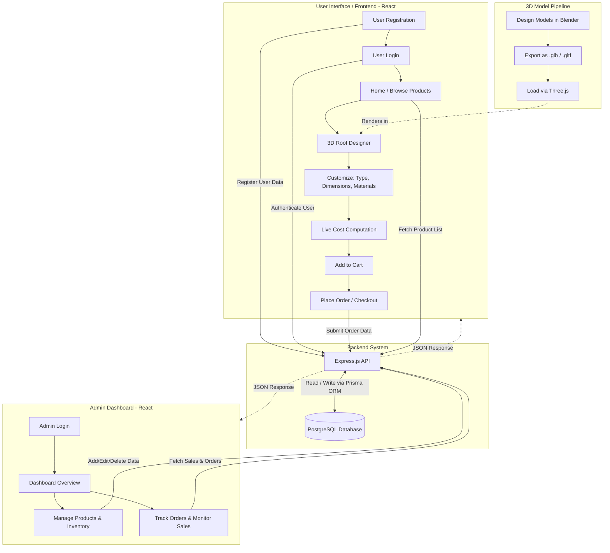

# 🔄 System Flowchart

This document outlines the high-level flow of the **3D Roofing Design and Inventory Management System**, including the user experience, admin management, backend data flow, and the 3D asset pipeline.

## System Architecture Flow

The following Mermaid diagram visualizes the overall architecture and interactions between different modules of the system:

### Flow Highlights:

1. **3D Integration Flow:** 3D Models are created in Blender, exported in `.glb`/`.gltf` format, and loaded dynamically into the interactive designer via Three.js.
2. **User Flow:** A user registers and logs into the application, browses products, enters the 3D designer to customize their roof (live cost computed), and proceeds to place an order.
3. **Data Flow:** All client interactions (both from users and admins) communicate with the Node.js/Express backend API, which queries the PostgreSQL database via Prisma ORM.
4. **Admin Flow:** Admins have a separate interface to monitor sales, update the inventory, and track placed orders.
